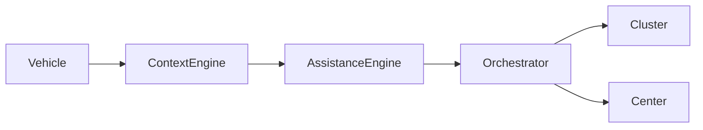
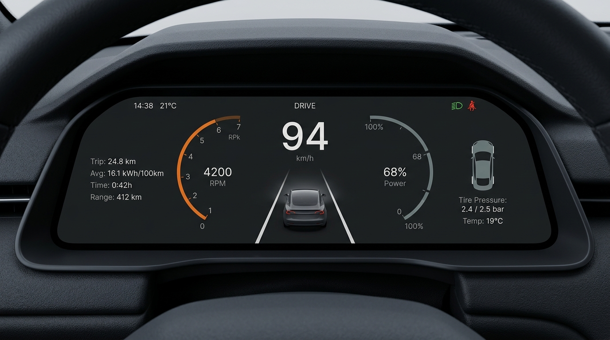
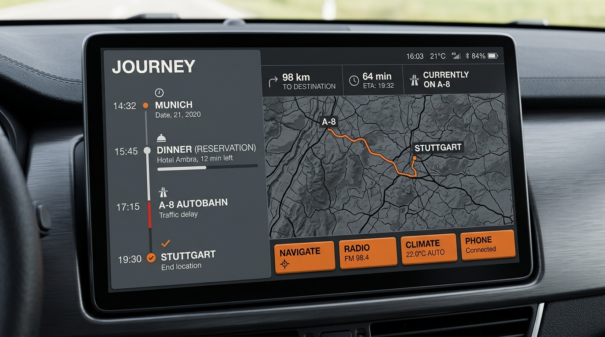
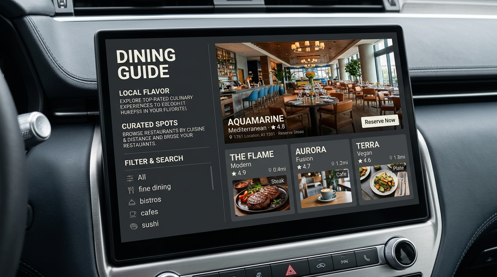
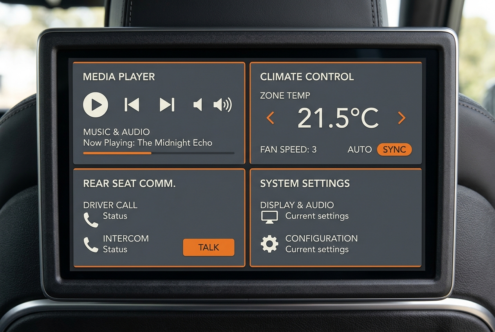
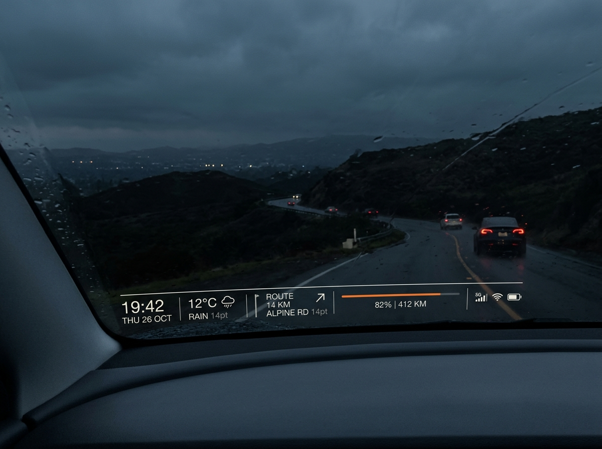

# AURA MASTER SPEC --- Integrated Product, Architecture and HMI Freeze

**Purpose:** Canonical product, architecture, interaction, and visual HMI
specification for Codex / GPT / coding agents.\
**Working codename:** AURA (configurable; not final branding).\
**Integrated revision:** 2026-10-02.\
**Status:** Product, Architecture, and HMI Freeze for Competition V1.\
**Important:** Sections 61--64 contain the latest frozen decisions and
supersede conflicting earlier wording. The final five HMI images linked
in Section 64 remain the highest authority for visible composition.

> This document freezes AURA's product, architecture, interaction rules,
> and Competition V1 HMI design. Website composition, sponsor placement,
> and final brand identity remain outside this freeze.

# AURA --- Adaptive Context-Aware Driving Companion

## Master System Specification (Integrated Logic and HMI)

> **Purpose:** This document is the source of truth for Codex / MTGPT
> and other coding agents. Sections 1–64 define the product, system, and
> frozen Competition V1 HMI. Section 64 defines the visual system, five
> HMI roles, and interaction presentation. The linked final images are
> authoritative for visible composition. Website and presentation-site
> design remain separate.
>
> **Core principle:** Build the system logic first. UI implementations
> must consume the same state, events, policies, and services rather
> than embedding cross-display logic in individual screens.

------------------------------------------------------------------------

## 0. Executive Summary

AURA is an adaptive, context-aware AI layer for a multi-display
automotive cockpit.

It is **not** merely: - a chatbot inside a vehicle, - a novice-driver
training app, - five independent screens, - an autonomous-driving
replacement, - or a collection of third-party APIs.

AURA observes the driver, vehicle, road/environment, navigation,
passengers, connectivity, and current task. It determines:

1.  **WHEN** AI should intervene.
2.  **HOW MUCH** assistance is appropriate.
3.  **WHERE** information should appear.
4.  **WHICH capability** should run locally or in the cloud.
5.  **HOW to preserve continuity** when connectivity changes.

Core proposition:

> **The right help, at the right moment, on the right display.**

AURA begins with a highly understandable pain point --- uncertainty and
cognitive overload experienced by novice drivers --- but generalizes to
**any driver in an uncertain, unfamiliar, high-load, or risky moment**.

------------------------------------------------------------------------

# 1. Problem Definition

Modern vehicles provide increasing amounts of information, alerts,
navigation, entertainment, and assistance. However, the amount of
assistance a driver needs is not constant.

Examples: - A novice driver may need step-by-step parking guidance. - An
experienced driver may need assistance at an unfamiliar complex
intersection. - Any driver may experience increased cognitive load
during heavy rain, confusing lane geometry, dense traffic, or an
unfamiliar parking environment. - Passengers have different information
and interaction needs from the driver. - Connectivity may disappear in
tunnels, underground parking, mountainous areas, or weak-coverage
regions.

The system should therefore avoid treating every driver and every
situation identically.

AURA addresses:

**Driver uncertainty + changing cognitive load + fragmented cockpit
information + connectivity instability.**

------------------------------------------------------------------------

# 2. Product Positioning

## 2.1 Primary Position

**AURA --- Adaptive Context-Aware Driving Companion**

AURA is an adaptive AI experience layer for the entire cockpit.

It should not permanently label a user as a "novice." Instead,
assistance depends on:

-   learned driver capability,
-   current maneuver,
-   road complexity,
-   vehicle state,
-   driver state / interaction load,
-   environmental conditions,
-   navigation context,
-   passenger context,
-   connectivity,
-   confidence and risk.

## 2.2 Product Philosophy

AURA should help without unnecessarily replacing the driver.

For learning-oriented scenarios:

``` text
Driver uncertainty
    ↓
AURA detects context
    ↓
AURA decides whether intervention is useful
    ↓
AURA reduces cognitive load
    ↓
AURA provides the next useful action
    ↓
Driver performs action
    ↓
AURA observes outcome
    ↓
Assistance adapts over time
```

Long-term principle:

> As a driver becomes more capable in a task, AURA should require less
> intervention.

## 2.3 Safety Boundary

AURA is primarily an **AI HMI / cognitive assistance / guidance system**
in this prototype.

Do not claim that the prototype itself guarantees collision avoidance or
safely controls steering, accelerator, or braking.

Safety-critical detection and immediate warnings must not depend on
cloud LLM latency.

------------------------------------------------------------------------

# 3. Competition Alignment

The competition brief emphasizes:

-   AI Cabin Perception Visualization
-   Context-Aware Smart Cockpit UX
-   Next Generation AI Agent Interface
-   Multi-display Experience
-   AI information presentation across displays
-   display role differentiation
-   AI Agent interaction flows across displays
-   Android HMI implementation
-   AI Box ↔ Ethernet ↔ Android HMI App
-   Android 14+ / Target SDK 34
-   future portability toward AAOS / CDC
-   avoiding vendor-specific dependencies
-   an end-to-end AI scenario
-   Hybrid AI / Offline AI as valuable implementation directions

The system architecture should therefore remain portable and should not
depend on Samsung-, Xiaomi-, or other device-specific SDK behavior.

------------------------------------------------------------------------

# 4. System Principles

1.  **One intelligence, multiple expressions.**
2.  Displays do not directly control each other.
3.  Local screen interaction remains local unless an explicit
    shared/system action occurs.
4.  Shared actions flow through common state/event/orchestration layers.
5.  Safety- and latency-sensitive functions are local-first.
6.  Cloud intelligence enhances capability but should not define basic
    availability.
7.  Connectivity loss should degrade capability gracefully rather than
    terminate the experience.
8.  AI should know when **not** to interrupt.
9.  Driver-facing responses become shorter as cognitive load/risk rises.
10. AURA remains one identity regardless of whether Local or Cloud
    intelligence handles a task.

------------------------------------------------------------------------

# 5. High-Level Architecture

``` text
AI Box
  │
Ethernet
  │
HMI Gateway
  │
Context Engine
  │
AI / Task Runtime
  │
AI Router
  ├──────────── Local Intelligence
  └──────────── Cloud Intelligence
  │
Shared State + Event Bus
  │
Experience Orchestrator
  │
  ├── Cluster
  ├── Center
  ├── Passenger
  ├── Rear
  └── Window
```

Supporting services:

``` text
Driver Capability Model
Cognitive / Interaction Load Engine
Assistance Engine
Connectivity Predictor
Continuity Engine
Task Manager
Voice Runtime
Navigation Provider
Places Provider
Weather Provider
Vehicle Data Provider
Cabin Perception Provider
```

------------------------------------------------------------------------

# 6. Five Display Roles

The five displays belong to one system but are independently interactive
where appropriate.

## Cluster

Purpose: - immediate driving information, - essential navigation, -
critical or high-priority AURA guidance, - low cognitive-load feedback.

It must not become a general AI chat surface.

## Center

Purpose: - primary vehicle control, - navigation, - parking / maneuver
guidance, - vehicle-related visualization, - detailed driver assistance
when appropriate.

## Passenger

Purpose: - exploration, - AI conversation, - trip planning, - POI
discovery, - complex information handling, - assisting the driver
without overloading the driver-facing displays.

## Rear

Purpose: - personal passenger experience, - trip information, - AI
interaction, - entertainment / exploration, - relevant shared trip
context.

## Interactive Window

Purpose: - ambient experience, - contextual / spatial information, -
passenger interaction, - time and weather information, - POI
discovery, - AI companion/presence, - handoff into richer experiences on
another display when needed.

The Window may support customizable ambient content such as animated
characters or user-selected imagery, but these are experience features
rather than core system architecture.

------------------------------------------------------------------------

# 7. State Architecture

## 7.1 Local State

Each display owns independent local state.

Examples:

``` yaml
cluster:
  transientGuidance:
  localMode:

center:
  currentPage:
  selectedPanel:
  mapViewport:
  parkingSession:

passenger:
  currentPage:
  selectedPOI:
  searchQuery:
  aiConversationView:

rear:
  currentPage:
  selectedMedia:
  selectedPOI:

window:
  ambientMode:
  selectedObject:
  interactionState:
```

A local action must not automatically modify another display.

Example:

``` text
Passenger opens POI details
→ Passenger local state changes
→ Center remains unchanged
```

## 7.2 Shared State

Suggested domains:

``` yaml
vehicle:
  speed:
  gear:
  steeringAngle:
  location:
  drivingState:
  batteryOrFuel:
  sensorSummary:

navigation:
  destination:
  route:
  nextTurn:
  eta:
  distance:
  laneContext:

trip:
  stops:
  activeStop:
  pendingChanges:

driver:
  capabilityProfile:
  currentLoad:
  assistanceLevel:
  familiarity:
  recentBehavior:

occupants:
  driver:
  passenger:
  rearPassengers:

environment:
  weather:
  time:
  roadContext:
  nearbyPOI:

ai:
  presenceState:
  activeIntent:
  activeTask:
  confidence:
  responseMode:
  connectivityMode:
  pendingTasks:

media:
  currentMedia:
  playbackState:
```

------------------------------------------------------------------------

# 8. Action Scope

Every user/system action should be classified.

## LOCAL

Examples: - open a page, - scroll, - inspect a POI, - move a local
map, - expand a card, - change a local ambient selection.

No other display changes.

## SHARED

Examples: - send a POI to another display, - share content, - request
handoff, - share a trip item.

Handled through Event Bus / Handoff Manager.

## VEHICLE / SYSTEM

Examples: - add trip stop, - start navigation, - change a vehicle
setting, - begin parking guidance, - accept an AI-recommended route
action.

Updates shared state and may trigger multi-display orchestration.

## SAFETY / PRIORITY EVENT

Examples: - wrong-gear context, - obstacle proximity event, - anomalous
pedal behavior signal, - urgent driving-state warning.

Must be processed through deterministic/local priority logic before any
optional generative AI layer.

------------------------------------------------------------------------

# 9. Experience Orchestrator

Displays must never directly command another display.

Incorrect:

``` text
Passenger → Center component
```

Correct:

``` text
Passenger Action
    ↓
System Event
    ↓
Shared State / Event Bus
    ↓
Experience Orchestrator
    ↓
Display-specific presentation commands/state
```

The orchestrator answers:

1.  What happened?
2.  Who needs to know?
3.  Does anyone need to be interrupted?
4.  What priority does the event have?
5.  Which display(s) should respond?
6.  What information density is appropriate?
7.  Should voice be used?
8.  Should information be delayed?
9.  Does the task require a handoff?

Suggested components:

``` text
Context Engine
Policy Engine
Priority Engine
Display Resolver
Presentation Resolver
Handoff Manager
Assistance Engine
```

------------------------------------------------------------------------

# 10. AURA Invocation

AURA should not require opening a dedicated AI application.

Supported invocation modes:

## 10.1 Wake Word

Working example:

``` text
"Hey AURA"
```

Wake-word branding may change later.

Pipeline:

``` text
IDLE
→ WAKE_DETECTED
→ LISTENING
```

## 10.2 Touch Invocation

Appropriate displays can expose an AURA presence/action within the
current context.

AURA should inherit current context rather than force users into a
separate generic chat page.

## 10.3 Implicit / Natural Intent

Example:

``` text
Passenger: "好冷喔"
↓
Local intent detection
↓
CABIN_TEMPERATURE_DISCOMFORT
↓
AURA may offer a contextual action
```

## 10.4 Proactive Invocation

AURA may initiate assistance when contextual benefit exceeds
interruption cost.

Proactive behavior must be governed by policy, not by arbitrary LLM
decisions.

------------------------------------------------------------------------

# 11. Proactive Intervention

Conceptual intervention score:

``` text
Relevance
× Urgency
× Confidence
× User Benefit
× Context Suitability
──────────────────────
Interruption Cost
```

Possible output:

``` text
DO_NOT_INTERRUPT
VISUAL_ONLY
SHORT_PROMPT
ASSIST
GUIDE
WARN
```

Examples:

Low-value:

``` text
Nearby generic café
→ remain silent
```

Higher-value:

``` text
Low EV battery
+ route context
+ long distance to next charging opportunity
→ proactive suggestion may be justified
```

------------------------------------------------------------------------

# 12. Adaptive Assistance Engine

AURA does not use a binary "novice / expert" switch.

Inputs:

``` text
Driver Capability
Current Maneuver
Road Complexity
Vehicle State
Driver Interaction Load
Environment
Navigation Context
Familiarity
Risk
```

Output levels:

``` text
L0 SILENT
L1 AWARE
L2 ASSIST
L3 GUIDE
L4 WARN
```

Examples:

``` text
Experienced driver + familiar road + low load
→ L0/L1

Experienced driver + unfamiliar complex junction
→ L2

Low parking capability + difficult parking context
→ L3

Immediate high-risk anomaly
→ L4
```

------------------------------------------------------------------------

# 13. Driver Capability Model

The system may maintain learned capability by task rather than one
global skill score.

Conceptual domains:

``` yaml
parking:
laneChange:
complexIntersection:
highway:
nightDriving:
navigation:
vehicleControlFamiliarity:
```

The model exists primarily to tune assistance.

Principle:

``` text
Capability ↑
→ unnecessary guidance ↓
```

Do not over-assist merely because the user was originally categorized as
a novice.

------------------------------------------------------------------------

# 14. Cognitive / Interaction Load Management

AURA should adapt the entire cockpit experience to current task load.

Canonical driver-load states:

``` text
LOW
NORMAL
HIGH
CRITICAL
```

Confidence in a load estimate is separate metadata. `UNCERTAIN` is not an
additional load state. The assistance ladder in Section 61.13 is a
separate measure of how much guidance AURA provides.

When load rises, AURA may:

-   reduce conversational verbosity,
-   suppress non-critical proactive suggestions,
-   queue non-critical notifications,
-   prioritize navigation/safety information,
-   reduce unnecessary ambient activity,
-   shorten spoken guidance,
-   avoid jokes or conversational filler.

Core principle:

> Sometimes the best AI action is to make the cockpit do less.

------------------------------------------------------------------------

# 15. Voice Interaction Runtime

Core states:

``` text
IDLE
LISTENING
THINKING
SPEAKING
EXECUTING
DONE
```

Additional states/events:

``` text
WAKE_DETECTED
BARGE_IN_DETECTED
STOP_REQUESTED
CANCELLED
OFFLINE
RECOVERING
```

## 15.1 Barge-In

During normal AI speech, users should be able to interrupt.

``` text
SPEAKING
→ user speech detected
→ BARGE_IN_DETECTED
→ stop TTS
→ LISTENING
```

Examples of immediate stop intents:

``` text
停
好了
不用了
閉嘴
stop
cancel
```

A stop request should stop rather than generate a verbose
acknowledgment.

## 15.2 Audio Requirements

Architecture should account for:

-   Voice Activity Detection (VAD)
-   wake-word detection
-   speech recognition
-   Text-to-Speech
-   Acoustic Echo Cancellation (AEC) or equivalent echo handling
-   interruption detection

## 15.3 Critical Confirmation

Not every sound should cancel a safety-critical confirmation.

Policy should distinguish:

``` text
NORMAL_RESPONSE → barge-in allowed
RECOMMENDATION → barge-in allowed
LONG_EXPLANATION → barge-in allowed
CRITICAL_CONFIRMATION → explicit handling required
```

------------------------------------------------------------------------

# 16. Response Policy

Response verbosity depends on role and context.

## Driver + Moving

Ultra concise.

Example:

``` text
"前方壅塞。改道可快 6 分鐘。要改道嗎？"
```

## Passenger / Rear

Normal conversational detail is allowed.

## Parked

More detailed explanation is acceptable.

## High Load / Risk

Minimal and direct.

No unnecessary conversational filler.

------------------------------------------------------------------------

# 17. Hybrid AI Architecture

The user experiences one AURA, not separate "Local AI" and "Cloud AI."

``` text
                    AURA
                      │
                 AI ROUTER
                      │
          ┌───────────┴───────────┐
          ↓                       ↓
        LOCAL                   CLOUD
```

## 17.1 Local Intelligence Responsibilities

Local-first capabilities may include:

-   wake word,
-   VAD,
-   barge-in / stop,
-   simple intent recognition,
-   basic speech handling,
-   cabin commands,
-   vehicle-context queries,
-   cached navigation context,
-   parking-state logic,
-   driver-state / load logic,
-   local RAG,
-   offline task state,
-   privacy-sensitive processing,
-   safety/priority event processing.

Local intelligence should be optimized for:

``` text
speed
availability
privacy
determinism where needed
offline continuity
```

## 17.2 Cloud Intelligence Responsibilities

Cloud-enhanced capabilities may include:

-   complex LLM reasoning,
-   multi-step agent planning,
-   complex trip planning,
-   broad knowledge,
-   live places data,
-   live weather,
-   live traffic,
-   rich recommendation reasoning,
-   complex tool calling.

Cloud is an enhancement, not the sole foundation of AURA.

------------------------------------------------------------------------

# 18. Progressive Response

For cloud tasks, Local intelligence can provide immediate
acknowledgement while Cloud processing continues.

Example:

``` text
User:
"附近有沒有適合吃飯的？"

Local:
"好，我找一下沿途的餐廳。"

Cloud:
Places + Route + Preferences + Reasoning

AURA:
"找到三間。我比較推薦第一間，只需要繞 6 分鐘。"
```

This hides unnecessary perceived latency without pretending Local
intelligence already knows the cloud result.

------------------------------------------------------------------------

# 19. Predictive Offline / AURA Continuity Engine

Working concept:

> **Predict. Prepare. Continue. Recover.**

Connectivity loss should be treated as a predictable operating condition
where possible.

## 19.1 Connectivity Modes

``` text
CONNECTED
PREPARING_OFFLINE
OFFLINE_CONTINUITY
CLOUD_RECOVERY
```

## 19.2 Connectivity Predictor

Potential inputs:

-   current network quality,
-   latency,
-   packet loss,
-   repeated API timeouts,
-   route,
-   tunnel / terrain context,
-   historical connectivity observations where available.

The predictor should be a system service, not an LLM guessing network
quality.

## 19.3 Pre-Offline Preparation

When weak/no connectivity is predicted, prepare route/task-relevant
information.

Potential offline package:

``` yaml
route:
  polyline:
  turns:
  etaSnapshot:
  alternateRoute:

places:
  routeRelevantPOIs:
  parking:
  food:
  charging:

environment:
  weatherSnapshot:
  sunsetTime:

aiContext:
  conversationSummary:
  activeIntent:
  activeTask:
  pendingTasks:

knowledge:
  routeRelevantDocuments:
```

## 19.4 Intent-Aware Prefetch

Do not cache everything.

Use current context to prioritize information likely to be needed next.

Example:

``` text
Current destination: scenic location
Time: near sunset
Likely next needs:
- parking
- food
- weather
- return route
- destination details
```

## 19.5 Structured Handoff

Cloud should pass Local a structured task state, not hidden reasoning.

Example:

``` yaml
task: AfternoonTripPlanning
goal: Return to hotel before 19:00
constraints:
  - minimal walking
  - scenic
  - detour under 15 minutes
currentPlan:
  - Qixingtan
  - CafeA
  - Hotel
pending:
  - Confirm CafeA
fallback:
  - CafeB
```

## 19.6 Offline Continuity

When offline:

-   local commands continue,
-   cached navigation context continues where technically available,
-   relevant cached knowledge can be queried,
-   AURA must clearly distinguish cached information from live
    information,
-   unsupported live requests must not be fabricated.

## 19.7 Freshness Metadata

Cached external information should include:

``` yaml
source:
fetchedAt:
freshness:
expiresAt:
requiresLiveVerification:
```

Classify information:

``` text
STATIC
SEMI_DYNAMIC
REAL_TIME
```

AURA must never present stale real-time data as currently verified.

## 19.8 Recovery

When connectivity returns:

``` text
NETWORK_RESTORED
→ synchronize local task state
→ reconcile changes
→ resume pending cloud tasks
→ enrich current result
```

The user should not need to repeat the original request.

------------------------------------------------------------------------

# 20. External Service Abstraction

Do not hard-code a specific provider into business logic.

Suggested interfaces:

``` text
AIProvider
NavigationProvider
PlacesProvider
WeatherProvider
TrafficProvider
VehicleDataProvider
CabinPerceptionProvider
SpeechProvider
ConnectivityProvider
```

Each should allow mock and real implementations.

Example:

``` text
NavigationProvider
├── MockNavigationProvider
└── RealNavigationProvider
```

Initial development may use mock providers while preserving
production-like contracts.

Recommended external capability categories:

1.  Cloud LLM / Agent
2.  Map / Places / Routing
3.  Weather
4.  Optional Traffic / Events / EV Charging, only when justified by a
    scenario

API count is not a KPI. A few tools genuinely used by the Agent are
preferable to many unused integrations.

------------------------------------------------------------------------

# 21. Navigation

Navigation should support the experience without requiring the team to
recreate a complete commercial navigation engine.

Provider should expose concepts such as:

``` text
searchPlaces()
getPlaceDetail()
calculateRoute()
getETA()
getDetourTime()
getNextManeuver()
```

Prototype priorities:

-   destination,
-   route,
-   ETA,
-   route preview,
-   turn-by-turn state,
-   waypoint/trip-stop changes,
-   reroute simulation or provider result,
-   shared navigation state across displays.

------------------------------------------------------------------------

# 22. Parking Guidance Scenario

Parking is a major demonstration of adaptive assistance.

Conceptual flow:

``` text
Parking intent detected
    ↓
Context collected
    ↓
Driver capability + maneuver difficulty evaluated
    ↓
AURA decides assistance level
    ↓
Optional guidance offered
    ↓
Step-by-step guidance
    ↓
Vehicle/driver response observed
    ↓
Guidance adapts
```

Possible contextual inputs:

-   gear,
-   speed,
-   steering angle,
-   vehicle pose,
-   parking-space geometry,
-   obstacle data,
-   camera/sensor-derived context.

Do not assume a fixed steering-wheel turn count works for all
vehicles/situations.

Guidance should conceptually derive from vehicle geometry/state and
trajectory estimation where available.

------------------------------------------------------------------------

# 23. Wrong-Gear / Pedal-Anomaly Concept

Safety-relevant signals should use deterministic/local logic first.

Example:

``` text
Parking maneuver
+ Gear = R
+ obstacle close
+ sudden accelerator increase
→ high-priority anomaly event
```

Flow:

``` text
Vehicle/Sensor State
→ Local Safety Logic
→ Priority Event
→ AURA HMI warning
```

Do not place a cloud LLM in the immediate safety loop.

Prototype positioning: demonstrate detection/visualization/guidance
logic; do not claim certified collision prevention.

------------------------------------------------------------------------

# 24. Complex Intersection Scenario

AURA may assist drivers before a maneuver becomes urgent.

Example:

``` text
Navigation turn upcoming
+ unfamiliar road
+ intersection complexity high
→ earlier lane guidance
```

AURA can provide concise anticipatory guidance rather than a last-second
navigation command.

Any interpretation of traffic rules/signage from perception must expose
uncertainty and should not be presented as guaranteed legal/safety
truth.

------------------------------------------------------------------------

# 25. Driver State / Uncertainty

Possible inputs:

-   cabin perception,
-   voice behavior,
-   repeated corrections,
-   hesitation,
-   interaction pattern,
-   maneuver history,
-   driving context.

Avoid overclaiming medical/emotional diagnosis.

Prefer concepts such as:

``` text
Interaction Load
Task Load
Uncertainty
Attention State
```

Output can influence assistance level and response policy.

------------------------------------------------------------------------

# 26. Living Window Logic

The interactive window is both:

1.  an ambient/personal surface during low-demand periods, and
2.  a contextual/spatial AI surface when relevant information exists.

Persistent logical information may include: - time, - weather.

Possible modes:

``` text
AMBIENT
AI_PRESENCE
SPATIAL_POI
CONTEXT_GUIDANCE
HANDOFF
```

Ambient content may include: - animated companion, - user-selected
image/content, - context-responsive ambient behavior.

Example handoff:

``` text
User taps POI on Window
→ WINDOW_POI_SELECTED
→ user requests more detail
→ Handoff Manager
→ Passenger opens relevant POI context
```

Do not turn the Window into a conventional full app launcher unless
later design decisions explicitly require it.

------------------------------------------------------------------------

# 27. AI Presence

AURA should have a consistent logical presence across displays.

The visual form and state presentation are defined in Section 64.4.

Canonical presence states:

``` text
IDLE
LISTENING
THINKING
SPEAKING
EXECUTING
OFFLINE
WARNING
```

The system exposes these seven states so every HMI can communicate one
consistent AURA presence. Task completion is represented by the task
lifecycle; `DONE` is not an additional presence state.

The AI presence may have an embodied/ambient representation, but the
product value is the state system and interaction clarity, not merely an
avatar.

------------------------------------------------------------------------

# 28. Privacy / User Control

The system should support concepts such as:

``` text
AI listening enabled/disabled
Proactive suggestions enabled/disabled
Cabin perception permissions
Microphone state
Camera state
Stop/cancel
```

When AI functionality is disabled, basic vehicle functionality must
remain available.

------------------------------------------------------------------------

# 29. Hero Scenario A --- Adaptive Parking Companion

Goal: demonstrate the clearest user pain point.

Flow:

``` text
Driver enters parking environment
→ AURA detects parking context
→ evaluates capability + difficulty
→ offers guidance if appropriate
→ driver accepts
→ step-by-step parking guidance
→ wrong gear / uncertainty can trigger concise intervention
→ driver completes parking
→ capability history can be updated
```

Important: - AURA assists rather than automatically taking over. -
guidance should adapt. - immediate safety signals are local-first. -
detailed assistance can be shown on appropriate display(s). - Cluster
remains concise.

------------------------------------------------------------------------

# 30. Hero Scenario B --- Cognitive Load Adaptation

Goal: prove AURA is not only for novice drivers.

Example context:

``` text
Heavy rain
+ unfamiliar road
+ complex intersection
+ navigation maneuver
+ incoming non-critical information
```

AURA:

``` text
detects high load
→ suppresses/delays non-critical information
→ reduces AI verbosity
→ prioritizes navigation/safety
→ keeps only relevant assistance active
```

When load returns to normal, normal passenger/ambient experiences can
resume.

------------------------------------------------------------------------

# 31. Hero Scenario C --- Predictive Offline Continuity

Goal: demonstrate Hybrid AI as a product capability.

``` text
Vehicle online
→ route predicts weak connectivity
→ Continuity Engine prepares task-relevant context
→ network becomes unavailable
→ Local AURA remains available
→ basic voice/vehicle/navigation/cached contextual tasks continue
→ live-only information is identified as unavailable/stale
→ network returns
→ task/context synchronizes
→ Cloud AURA resumes pending work
```

The user interacts with one continuous AURA identity throughout.

------------------------------------------------------------------------

# 32. Supporting Scenario --- Contextual Trip Discovery

This scenario demonstrates cloud-enhanced intelligence and multi-display
collaboration.

``` text
Context/POI opportunity detected
→ relevant passenger/window surface presents discovery
→ user asks AURA a natural-language question
→ Cloud Agent uses Places + Route + Weather
→ recommendation returned
→ user adds stop
→ Shared State updates
→ Orchestrator updates relevant displays
```

This scenario supports the broader cockpit experience but should not
replace the stronger adaptive-driving story.

------------------------------------------------------------------------

# 33. Multi-Display Event Example

``` text
Passenger:
ADD_TRIP_STOP(placeId)

        ↓

Event Bus

        ↓

Trip Service updates Shared State

        ↓

Experience Orchestrator

        ↓

Cluster:
navigation-relevant update only

Center:
route/navigation state update

Passenger:
confirmation

Rear:
shared trip state if relevant

Window:
spatial/contextual update if relevant
```

No display directly mutates another display.

------------------------------------------------------------------------

# 34. Suggested Event Taxonomy

``` text
AI_WAKE_REQUESTED
AI_LISTENING_STARTED
AI_BARGE_IN
AI_STOP_REQUESTED
AI_TASK_STARTED
AI_TASK_COMPLETED

VEHICLE_STATE_UPDATED
DRIVER_LOAD_CHANGED
ASSISTANCE_LEVEL_CHANGED

NAVIGATION_STARTED
NAVIGATION_UPDATED
TRIP_STOP_ADDED

PARKING_CONTEXT_ENTERED
PARKING_GUIDANCE_STARTED
PARKING_GUIDANCE_STEP_CHANGED

SAFETY_PRIORITY_EVENT

POI_DETECTED
POI_SELECTED
DISPLAY_HANDOFF_REQUESTED

CONNECTIVITY_DEGRADING
OFFLINE_PREPARATION_STARTED
OFFLINE_MODE_ENTERED
NETWORK_RESTORED
CLOUD_TASK_RESUMED
```

------------------------------------------------------------------------

# 35. Suggested Core Interfaces

Conceptual only; implementation language may vary.

``` text
interface AIProvider
interface LocalAIProvider : AIProvider
interface CloudAIProvider : AIProvider

interface NavigationProvider
interface PlacesProvider
interface WeatherProvider
interface TrafficProvider

interface VehicleDataProvider
interface CabinPerceptionProvider
interface ConnectivityProvider

interface EventBus
interface SharedStateStore
interface ExperienceOrchestrator
interface AssistanceEngine
interface ContinuityEngine
interface TaskManager
interface VoiceRuntime
```

------------------------------------------------------------------------

# 36. Development Strategy

Do not implement everything simultaneously.

Recommended order:

``` text
Phase 1
Project architecture
Five display modules
Shared State
Local State
Event Bus

Phase 2
Experience Orchestrator
Action scopes
Cross-display handoff

Phase 3
AURA state machine
Wake/touch invocation
Voice runtime abstraction
Barge-in / stop

Phase 4
Adaptive Assistance
Driver Capability Model
Cognitive Load Engine

Phase 5
Parking Hero Scenario
Complex-intersection / load scenario

Phase 6
Local/Cloud AI Router
Provider abstractions
Cloud tool calling

Phase 7
Continuity Engine
Offline context
Recovery

Phase 8
Living Window logic
Trip discovery
Additional passenger/rear experiences

Phase 9
Android HMI / AI Box integration
Ethernet gateway
End-to-end validation

Phase 10
Reliability / demo hardening
```

------------------------------------------------------------------------

# 37. Web Development vs Final HMI

A web implementation can be used for rapid development, multi-display
simulation, state validation, and interaction testing.

However, competition implementation requirements should remain
compatible with:

``` text
AI Box
↕ Ethernet
Android HMI App
Android 14+
Target SDK 34
future AAOS / CDC portability
```

Do not architect the business logic so that it only works inside a
browser.

Keep:

``` text
Domain logic
State
Events
Agent runtime
Provider contracts
Orchestration
```

separable from rendering technology.

------------------------------------------------------------------------

# 38. Mock vs Real Services

Early implementation should prioritize complete interaction over
premature external integration.

Use:

``` text
MockVehicleDataProvider
MockNavigationProvider
MockPlacesProvider
MockWeatherProvider
MockCabinPerceptionProvider
```

behind the same interfaces later used by real providers.

A mock must simulate the same event/state contracts rather than
hard-code UI transitions.

------------------------------------------------------------------------

# 39. Coding-Agent Rules

Any coding agent working on this project must:

1.  Read this specification before modifying architecture.
2.  Preserve display independence.
3.  Never implement direct display-to-display calls.
4.  Keep local and shared state separate.
5.  Route cross-display actions through system events/orchestration.
6.  Keep external APIs behind provider interfaces.
7.  Keep safety/priority logic local-first.
8.  Treat cloud AI as enhancement rather than a required dependency for
    core operation.
9.  Preserve task continuity across connectivity transitions.
10. Make visible interactive controls functional; do not create
    non-functional decorative controls unless explicitly requested.
11. Avoid vendor-specific Android dependencies unless explicitly
    approved.
12. Follow Section 64 and its final image references for Competition V1
    HMI design; do not replace them with an earlier visual draft.
13. Keep website composition, sponsor placement, and final brand identity
    configurable until separately approved.

------------------------------------------------------------------------

# 40. Explicitly Deferred Decisions

Competition V1 HMI colors, typography, materials, layouts, and interaction
presentation are frozen in Section 64. The following remain outside this
specification and require separate approval:

-   website and demo-site composition,
-   sponsor, partner, and backend-provider logo placement,
-   final product name, assistant name, and logo system,
-   presentation-site storytelling and visual hierarchy.

Coding agents must not treat these remaining omissions as permission to
make permanent brand or presentation decisions.

------------------------------------------------------------------------

# 41. Non-Goals

Do not spend primary development effort on:

-   recreating a full commercial navigation engine,
-   building many unrelated vehicle apps,
-   maximizing API count,
-   making every display behave like a tablet,
-   using an LLM for deterministic safety logic,
-   making AI speak constantly,
-   forcing cloud dependency for simple tasks,
-   building a separate developer-control screen as the primary demo
    experience,
-   claiming autonomous-driving or certified safety capabilities.

------------------------------------------------------------------------

# 42. Definition of Success

A successful prototype should make a reviewer understand, through direct
interaction, that:

1.  AURA is one AI across the whole cockpit.
2.  It understands driver capability and current context.
3.  It can decide when to stay silent.
4.  It can adapt how much help it gives.
5.  It can use different displays for different roles.
6.  It can be naturally invoked and interrupted.
7.  Important local capabilities survive network loss.
8.  Cloud connectivity increases capability without changing AURA's
    identity.
9.  Offline preparation and recovery preserve task continuity.
10. The architecture can later move from prototype rendering to
    Android/AAOS-oriented deployment.

------------------------------------------------------------------------

# 43. One-Sentence Product Definition

> **AURA is an adaptive AI cockpit layer that understands the driver,
> vehicle, environment and current task, then decides when to help, how
> much to help, and where that help should appear --- while preserving
> continuity between local and cloud intelligence.**

------------------------------------------------------------------------

# 44. Short Context for Future Agents

If token budget is extremely limited, use this section as the minimum
project context:

``` text
PROJECT: AURA — Adaptive Context-Aware Driving Companion.

GOAL:
Build one AI cockpit system across Cluster, Center, Passenger, Rear and Interactive Window.

CORE:
AURA decides WHEN to intervene, HOW MUCH assistance is appropriate, and WHERE information should appear.

TARGET:
Not only novice drivers. Novice parking is the strongest entry scenario, but the general problem is driver uncertainty and changing cognitive load.

ARCHITECTURE:
AI Box → Ethernet → HMI Gateway → Context Engine → AI Router → Shared State/Event Bus → Experience Orchestrator → 5 Displays.

RULE:
Displays never directly control each other. Local interactions stay local. Shared/system actions go through events/state/orchestration.

AI:
One AURA identity.
Local = wake word, VAD, interruption, simple intents, cabin/vehicle commands, safety-priority logic, local RAG, offline continuity.
Cloud = complex reasoning, tool calling, live Places/Weather/Traffic, complex planning.

ADAPTIVE ASSISTANCE:
L0 SILENT / L1 AWARE / L2 ASSIST / L3 GUIDE / L4 WARN.
Inputs include driver capability, maneuver, road complexity, vehicle state, load, environment and risk.

VOICE:
Wake word + touch + implicit intent + proactive intervention.
AI must support barge-in and immediate stop.

OFFLINE:
AURA Continuity Engine = Predict → Prepare → Continue → Recover.
Predict connectivity loss, prefetch task-relevant context, continue locally, synchronize and resume cloud tasks after recovery.

HERO SCENARIOS:
1. Adaptive parking companion.
2. Cognitive-load adaptation at difficult driving moment.
3. Predictive offline continuity.
4. Supporting contextual trip discovery.

SAFETY:
Do not use cloud LLM in immediate safety loop. Prototype is guidance/HMI, not autonomous driving.

UI / HMI:
Competition V1 visual language, five-display roles, layouts, and
interaction presentation are defined in Section 64. The five linked final
images are the authority for visible composition. Website and final brand
identity remain deferred.
```

------------------------------------------------------------------------

------------------------------------------------------------------------

# 45. Implementation Language and Architecture Decision

This section defines the current recommended engineering direction. It
is intended to reduce ambiguity for Codex / MTGPT and must preserve the
HMI authority defined in Section 64.

## 45.1 Recommended Technology Direction

``` text
Web Reference Prototype / Multi-display Simulator
→ TypeScript + React

Final Android HMI
→ Kotlin + Jetpack Compose

AI Box / Services
→ implementation language may vary,
  but communication contracts must remain platform-neutral

Cross-process / cross-device payloads
→ JSON

Architecture documentation
→ Markdown + Mermaid

Typed contracts / reference schemas
→ TypeScript

Human-readable scenarios / mock fixtures
→ YAML
```

Important: Do not build two complete UI implementations at the same
time. First validate the system behavior in the web reference
implementation, then port the required HMI behavior to Android.

## 45.2 Why TypeScript Instead of Plain JavaScript

AURA has many shared domain concepts:

``` text
VehicleState
DriverState
NavigationState
AIState
ConnectivityState
ParkingState
DisplayState
SystemEvent
```

TypeScript provides explicit contracts and compile-time checking, which
reduces naming drift and incompatible payloads across multiple coding
agents.

Example:

``` ts
type Gear = "P" | "R" | "N" | "D";

interface VehicleState {
  speedKph: number;
  gear: Gear;
  steeringAngleDeg: number;
}
```

Benefits: - stronger contracts, - safer refactoring, - fewer runtime
type errors, - easier multi-agent implementation, - clearer API
boundaries, - easier generation of tests/mocks.

Costs: - additional type definitions, - slightly more boilerplate, -
higher initial learning cost than JavaScript.

Decision: **Prefer TypeScript for the web reference implementation.**

## 45.3 Why React

React is recommended for the web reference implementation because AURA
naturally decomposes into independent display/component trees driven by
state.

``` text
Web Simulator
├── ClusterDisplay
├── CenterDisplay
├── PassengerDisplay
├── RearDisplay
└── WindowDisplay
```

React is not the core architecture. The important architecture is
state/event/domain separation. React is the rendering implementation for
the web prototype.

Benefits: - mature ecosystem, - strong TypeScript support, -
state-driven rendering, - good tooling, - strong coding-agent
familiarity, - suitable for showing multiple displays simultaneously in
a browser.

Costs: - UI will not directly become native Android Compose UI, - poor
architecture can still create component coupling, - ecosystem offers
many competing patterns.

## 45.4 Alternatives

### Vue + TypeScript

Advantages: - approachable syntax, - Composition API is suitable for
structured state, - Pinia provides straightforward state management, -
efficient for small teams.

Disadvantages relative to the current recommendation: - no decisive
architecture advantage for this project, - React has broader
examples/ecosystem for complex agent-generated applications.

Use Vue if the implementation team is materially more experienced with
Vue.

### Svelte / SvelteKit

Advantages: - concise code, - low boilerplate, - strong prototyping
experience.

Disadvantages: - smaller ecosystem, - fewer established
patterns/examples for a complex multi-agent cockpit project, - less
attractive when consistency across many generated modules is important.

### Flutter

Advantages: - strong cross-platform story, - significant UI reuse
between Android and web, - strong animation/rendering capabilities, -
attractive if minimizing Android UI rewrite is the primary objective.

Disadvantages: - browser-based multi-display simulation and web tooling
are less natural than a conventional web stack, - AAOS/native Android
service and vehicle integration may still require platform-specific
work, - adopting Dart adds another language to the stack.

Flutter remains the strongest alternative to React if the team
prioritizes maximum Web→Android UI reuse.

### Kotlin + Jetpack Compose

Advantages: - native Android integration, - Android
lifecycle/services/audio/permissions/network integration, - strongest
long-term alignment with Android/AAOS HMI, - appropriate for final
Android HMI.

Disadvantages for the first prototype: - slower for a browser-based
five-display simulator, - makes fast web presentation/testing less
convenient, - developing full web and Compose versions in parallel would
duplicate effort.

Decision: **Use Kotlin + Compose for the final Android HMI layer, not as
a requirement for the initial browser reference implementation.**

## 45.5 Current Comparative Decision

``` text
TypeScript + React
→ preferred Web reference implementation

Flutter
→ strongest alternative if cross-platform UI reuse becomes the dominant requirement

Kotlin + Jetpack Compose
→ preferred final Android / AAOS-oriented HMI direction
```

------------------------------------------------------------------------

# 46. State-Driven Architecture

The source of truth must be domain state, not individual screens.

Incorrect:

``` text
Passenger
→ call Center
→ call Cluster
→ call Window
```

Correct:

``` text
Passenger Action
→ semantic event / command
→ domain state update
→ orchestration
→ relevant displays render current state
```

## 46.1 Local vs Shared State

Use local state for interaction that does not affect the vehicle/system.

Examples:

``` text
selected tab
expanded card
local map viewport
scroll position
local modal
```

Use shared state for domain truth that multiple modules may require.

Examples:

``` text
vehicle gear
active route
trip stops
AI task
connectivity mode
driver assistance level
```

Do not place every UI detail into global/shared state.

------------------------------------------------------------------------

# 47. Event-Driven Architecture

State represents:

> **What is true now?**

Events represent:

> **What just happened?**

Examples:

``` text
State:
gear = R
connectivity = weak

Events:
GEAR_CHANGED
NETWORK_DEGRADING
PARKING_CONTEXT_ENTERED
AI_BARGE_IN
```

Use direct local state updates for purely local UI interactions.

Use semantic events for system-wide actions, domain transitions,
cross-display effects, and priority conditions.

Avoid eventifying trivial UI behavior.

------------------------------------------------------------------------

# 48. Provider Abstraction

External dependencies must be hidden behind stable interfaces.

Example:

``` ts
interface PlacesProvider {
  searchNearby(input: PlaceSearchInput): Promise<Place[]>;
  getPlace(id: string): Promise<Place>;
}
```

Possible implementations:

``` text
PlacesProvider
├── MockPlacesProvider
├── HerePlacesProvider
├── GooglePlacesProvider
└── OtherPlacesProvider
```

Benefits: - providers can be replaced, - mock services support reliable
demos, - external outages do not dictate application architecture, - API
selection can remain open during early development, - easier
offline/cached implementations.

Cost: - additional abstraction/boilerplate.

Only abstract meaningful external/platform dependencies. Do not create
unnecessary providers for ordinary UI components.

------------------------------------------------------------------------

# 49. State Machines

Use explicit state machines for workflows where invalid combinations
would otherwise be easy to create.

Recommended state-machine candidates:

``` text
AURA Voice Lifecycle
AI Task Lifecycle
Parking Guidance
Connectivity / Continuity
```

Example:

``` text
IDLE
→ LISTENING
→ THINKING
→ SPEAKING
→ DONE

SPEAKING
→ BARGE_IN
→ LISTENING
```

Avoid state machines for trivial controls.

The goal is to prevent contradictory states such as:

``` text
isListening = true
isSpeaking = true
isInterrupted = true
```

without an explicitly defined meaning.

------------------------------------------------------------------------

# 50. Specification Syntax for Coding Agents

Use different formats for different purposes rather than forcing all
information into prose.

## Markdown

Use for: - product rules, - architecture decisions, - implementation
instructions, - ADR summaries, - acceptance criteria.

Reason: - low overhead, - human-readable, - coding-agent friendly, -
Git-friendly.

## Mermaid

Use for: - architecture diagrams, - state transitions, - sequence/data
flow, - module relationships.

Do not use Mermaid for final UI mockups.

Example:



## TypeScript Contracts

Use for: - canonical domain types, - event payloads, - provider
interfaces, - reference state schemas.

Example:

``` ts
type AssistanceLevel = 0 | 1 | 2 | 3 | 4;

interface DriverContext {
  assistanceLevel: AssistanceLevel;
  cognitiveLoad: "low" | "normal" | "high" | "risk";
  roadFamiliarity: number;
  parkingCapability: number;
}
```

## YAML

Use for: - scenarios, - mock fixtures, - acceptance examples, -
replayable demo timelines.

Example:

``` yaml
scenario: difficult_parking

initial:
  vehicle:
    speedKph: 0
    gear: D

  driver:
    parkingCapability: 0.32

trigger:
  type: PARKING_CONTEXT_ENTERED

expected:
  assistanceLevel: GUIDE
```

## JSON

Use for: - actual runtime API payloads, - WebSocket messages, -
cross-process/device communication, - persisted machine-facing payloads
where appropriate.

Rule:

``` text
Markdown = explanation
Mermaid = relationships/flow
TypeScript = compile-time contracts
YAML = human-authored scenarios
JSON = runtime interchange
```

------------------------------------------------------------------------

# 51. Web-to-Android Portability Rule

The web prototype is a **reference implementation of behavior**, not the
final platform architecture.

Keep these layers independent from React:

``` text
Domain models
Events
Policies
Assistance rules
Task lifecycle
Provider contracts
Scenario fixtures
Protocol schemas
```

The Android HMI should be able to reproduce the same behavior using
Kotlin/Compose without needing to reproduce React-specific internals.

Do not treat React hooks/components as the canonical definition of
system behavior.

------------------------------------------------------------------------

# 52. Current Engineering Decision Summary

Current recommendation:

``` text
Web:
TypeScript + React

Architecture:
State-driven
+ Event-driven
+ Provider abstraction
+ State machines where justified

Final Android:
Kotlin + Jetpack Compose

Documentation:
Markdown + Mermaid

Reference contracts:
TypeScript

Scenario fixtures:
YAML

Runtime interchange:
JSON
```

These decisions may be revisited before large-scale implementation if
team skills or competition constraints materially change.

------------------------------------------------------------------------

# 53. Open Decisions Before Large-Scale Coding

The following items should be discussed and frozen before asking Codex /
MTGPT to implement the entire system.

## A. Repository / Runtime Topology

Decide whether the project is:

``` text
Monorepo
├── web-simulator
├── shared-contracts
├── ai-gateway
├── mock-services
└── android-hmi
```

or separated into multiple repositories.

Recommended default: **monorepo** during competition development unless
team/process constraints require otherwise.

## B. Web State Management

Choose the actual implementation for: - shared domain store, - local
display state, - derived selectors, - event dispatch.

Candidates may include lightweight stores, Redux-style architecture, or
a custom typed domain store.

Do not choose purely based on popularity; optimize for traceability and
low complexity.

## C. Event Bus Scope

Decide: - in-process web events, - cross-tab/window events, - network
events from AI Box, - event persistence/replay requirements.

Avoid using one transport mechanism for every layer merely because the
names are similar.

## D. AI Box ↔ HMI Protocol

Must freeze: - transport, - connection lifecycle, - request/response vs
streaming, - event message envelope, - versioning, - reconnect
behavior, - heartbeat, - timeout/cancellation, - offline behavior.

Candidate transports to compare: - WebSocket, - HTTP/SSE, - MQTT, - gRPC
where environment permits.

## E. AI Runtime Placement

Decide which components live on: - HMI, - AI Box, - cloud.

At minimum separate: - wake/VAD/barge-in, - local intent/SLM, -
orchestration, - cloud-agent gateway, - tool execution, - cache/RAG.

## F. Local Model Strategy

Need to decide: - whether the competition prototype runs a real local
model or simulated/local rules for some capabilities, - target model
size, - hardware assumptions, - inference runtime, - latency target, -
quantization, - local RAG requirements.

Do not choose a model before hardware/runtime constraints are known.

## G. Cloud Model Strategy

Need to define: - provider abstraction, - tool-calling contract, -
structured outputs, - streaming, - timeout/fallback, - cost limits, -
prompt/context policy, - whether multiple cloud models are necessary.

## H. Speech Stack

Need to decide: - wake-word engine, - ASR, - TTS, - VAD, - AEC
strategy, - offline vs cloud speech split, - interruption latency
target.

## I. Vehicle / Sensor Data Contract

Need to define which signals are actually available in the prototype.

Possible signals: - speed, - gear, - steering angle, - location, -
obstacle distance, - parking context, - battery/fuel, - cabin/driver
perception signals.

Separate:

``` text
real signal
simulated signal
derived signal
```

Never imply simulated competition data is production-grade sensing.

## J. Navigation / Places Provider

**Decision: Mapbox** (Selected 2026-10-02)

- **Map rendering provider:** Mapbox SDK for Android (v11) using custom AURA-styled vector tiles from Mapbox Studio.
- **Routing provider:** Mapbox Navigation SDK.
- **Place search provider:** Mapbox Search.
- **Offline-map strategy:** Mapbox Navigation SDK tile caching for local routing and rendering.
- **Licensing/API constraints:** Free tier allows up to 50k map loads/mo. Navigation SDK free for development.
- **Mock fallback:** Real-time parking and ADAS signals (e.g., road curvature, exact slope) will be simulated for the V1 competition demo as Mapbox lacks deep native automotive/parking APIs.

Provider choice maximizes custom styling capabilities to highlight AURA's AI layer, favoring hackathon velocity over native deep-automotive data (which will be mocked per product principles).

## K. Persistence / Local Cache

Need to decide what survives restart: - driver capability, - trip
state, - cached route, - offline package, - AI task summary, - user
preferences.

Also define TTL/freshness policies.

## L. Driver Capability Learning

Need to define: - what observations update capability, - whether updates
are rule-based or ML-based in prototype, - minimum evidence before
changing assistance, - reset/manual override, - explainability, -
privacy.

Avoid opaque "AI score" without a defensible update rule.

## M. Cognitive Load Estimation

Need to define: - exact inputs, - thresholds, - confidence, -
smoothing/hysteresis, - false-positive handling, - what behaviors are
allowed at each load level.

## N. Safety / Intervention Policy

Need a deterministic priority matrix defining: - what can interrupt, -
what must wait, - what requires confirmation, - what is visual-only, -
what may use voice, - what is never delegated to generative AI.

## O. Demo Scenario Dataset

Need reproducible timelines for: 1. adaptive parking, 2. cognitive-load
adaptation, 3. predictive offline continuity, 4. contextual trip
discovery.

Each scenario should define: - initial state, - timed/input events, -
expected shared-state changes, - expected AURA decision, - expected
display responsibilities, - fallback path.

## P. Testing Strategy

Need: - unit tests for policies/state, - event-flow tests, - scenario
replay tests, - provider contract tests, - offline/reconnect tests, -
cancellation/barge-in tests.

The system should be demoable from deterministic fixtures even if
external APIs fail.

## Q. Logging / Observability

Need structured logs for: - input context, - event, - policy decision, -
AI route local/cloud, - tool calls, - state changes, - display
targets, - latency, - fallback reason.

This is important for debugging multi-display behavior.

## R. Security / Privacy Boundary

Need to define: - what data may leave the vehicle, - what remains
local, - consent for microphone/camera, - storage duration, -
redaction, - secrets/API key handling.

## S. Performance Targets

Need approximate budgets for: - wake response, - stop/barge-in, - local
warning, - display synchronization, - cloud first response, - offline
transition, - reconnect/resume.

Without targets, "fast" cannot be tested.

## T. Deployment / Demo Environment

Need to decide: - one browser with five embedded displays, - five
browser windows/devices, - Android tablets/emulators, - hybrid web +
Android, - AI Box hardware or laptop simulation.

This decision affects transport and synchronization architecture.

## U. Definition of MVP vs Stretch

Must freeze what is required for judging versus optional.

Suggested MVP: - five independently interactive display roles, - shared
state/event orchestration, - one working AURA invocation path, -
barge-in/stop, - adaptive parking scenario, - cognitive-load
adaptation, - real Local/Cloud routing or credible implementation, -
offline/recovery scenario, - at least one meaningful external tool
integration.

Stretch: - advanced driver-learning model, - real connectivity
prediction, - richer multimodal perception, - additional APIs, -
advanced ambient/window experiences.

## V. UI / Presentation Specification

Competition V1 HMI visuals and interaction presentation are frozen in
Section 64. Website composition, sponsor placement, and final brand/logo
identity remain deferred as described in Section 40.

------------------------------------------------------------------------

# 54. Working Codename and Renameability

`AURA` remains the **working codename only** until the final project and
assistant naming decision is made.

Do not hard-code the product/assistant name throughout business logic.
Centralize branding:

``` ts
export const BRAND = {
  projectName: "AURA",
  assistantName: "AURA",
  wakeWord: "Hey AURA",
};
```

Prefer neutral internal names such as:

``` text
AssistantState
VoiceRuntime
AIProvider
ReasoningProvider
IntelligenceRouter
```

rather than product-name-coupled names such as `AuraState` or
`AuraProvider`.

Goal: final renaming should require changing centralized
configuration/document metadata, not rewriting architecture.

------------------------------------------------------------------------

# 55. Free-First / Local-First AI Strategy

Current development priority:

``` text
1. Free + Local where practical
2. Free cloud APIs where cloud capability is needed
3. Paid strong-model provider only if benchmarks prove it is necessary
```

The architecture must not depend on a single AI vendor.

## 55.1 Local Runtime

Current baseline:

``` text
Ollama
└── Qwen-family small/medium local model
    ├── development target: ~4B class
    └── stronger local target: ~8B class if AI Box hardware permits
```

Exact model/version remains replaceable and should be benchmarked on the
actual target hardware.

Local responsibilities:

``` text
Wake word
VAD / interruption detection
Immediate STOP / barge-in path
Simple intents
Simple cabin/vehicle commands
Offline conversational fallback
Local RAG / cached context
Task continuity
Deterministic safety/policy logic
```

Safety-critical immediate behavior must not depend on a generative
model.

## 55.2 Cloud / API Providers

Use provider interfaces rather than vendor-specific calls inside
domain/UI code.

Initial free-first candidates to evaluate:

``` text
SpeechProvider
├── free-tier Whisper-compatible/cloud STT provider
├── realtime speech provider when useful
└── LocalSpeechProvider

FastReasoningProvider
├── free-tier low-latency cloud model
└── local Ollama fallback

DeepReasoningProvider
└── intentionally replaceable; paid provider may be added later only if needed
```

The specific vendor is an implementation choice, not part of AURA's
identity.

## 55.3 Task Complexity Routing

Classify tasks before choosing a model:

``` text
T0 REFLEX
Wake / stop / interruption / immediate policy
→ Local deterministic path

T1 SIMPLE
Simple intent / cabin command / short contextual question
→ Local model

T2 NORMAL
General conversation / simple recommendation / ordinary tool use
→ Fast/free cloud when available

T3 COMPLEX
Multi-constraint planning / difficult reasoning / multi-tool synthesis
→ Strong reasoning provider
```

Routing factors:

``` text
Latency requirement
Risk
Task complexity
Connectivity
Privacy
Tool requirement
Cost
Model confidence
```

Users should experience one assistant identity regardless of which
provider executes the task.

------------------------------------------------------------------------

# 56. AI Perception → Reasoning → Action Pipeline

Recommended runtime pipeline:

``` text
Perception
   ↓
Local Reflex
   ↓
Context Engine
   ↓
Intelligence Router
   ↓
Local / Fast Cloud / Deep Cloud / Tool
   ↓
Policy Engine
   ↓
Assistance Engine
   ↓
Experience Orchestrator
   ↓
Display / Voice / Tool Action
```

Input signal domains:

``` text
Voice / Audio
Driver
Vehicle
Road / Navigation
Environment
System / Connectivity
Touch / Display interaction
```

Normalize signals with provenance:

``` ts
interface ContextSignal<T> {
  type: string;
  value: T;
  source: "sensor" | "simulated" | "api" | "derived";
  timestamp: number;
  confidence?: number;
}
```

Do not treat an inferred audio/behavior cue as a definitive
psychological diagnosis. Such cues may contribute to context only
alongside other signals.

------------------------------------------------------------------------

# 57. Action Governance

A generative model may **propose** an action, but system policy
determines whether it may execute.

Canonical action categories may include:

``` text
SPEAK
SHOW_INFORMATION
SHOW_GUIDANCE
SEARCH_PLACE
CALCULATE_ROUTE
ADD_TRIP_STOP
START_PARKING_GUIDANCE
HANDOFF_DISPLAY
SUPPRESS_NOTIFICATION
CHANGE_CABIN_SETTING
PREPARE_OFFLINE_CONTEXT
REQUEST_CONFIRMATION
WARN
```

Pattern:

``` text
Model proposes structured action
        ↓
Policy validates
        ↓
Confirmation if required
        ↓
Domain service executes
        ↓
Shared state/event
        ↓
Experience Orchestrator
        ↓
Relevant displays
```

Never allow unrestricted model-generated commands to directly control
safety-critical vehicle actuation.

------------------------------------------------------------------------

# 58. Predictive Offline Preparation

Continuity should use cloud capability before anticipated network loss
when useful.

``` text
Connectivity Risk rises
        ↓
Continuity Engine
        ↓
Prepare task-relevant context
        ↓
Route summary
Trip constraints
Relevant POIs
Destination context
Task state
Selected cached knowledge
        ↓
Local Cache / RAG
        ↓
Offline Local Model
```

The goal is not to make a small local model equal to a frontier cloud
model. The goal is to reduce the offline problem into a smaller,
well-contextualized task that the local system can complete reliably.

------------------------------------------------------------------------

# 59. Domain-Adapted Local Cabin Model

AURA may later include a specialized local model derived from a
downloadable base model.

Goal:

> Make the local model highly reliable for AURA-specific cockpit
> behavior rather than attempting to reproduce frontier-model general
> intelligence.

Recommended approach:

``` text
Base local model
    ↓
AURA scenario dataset
    ↓
SFT / LoRA / QLoRA experimentation
    ↓
AURA Cabin Model
    ↓
Quantization
    ↓
Ollama / AI Box deployment
```

Fine-tuning should primarily teach:

``` text
AURA response behavior
Intent classification
Structured action output
Tool/action selection
Concise in-car language
Context usage
Interruption behavior
Ambiguity handling
When to defer/escalate
```

Do not fine-tune rapidly changing knowledge such as current routes,
weather, live POIs, or current vehicle state. Supply those through
context/tools/RAG.

Do not fine-tune deterministic safety thresholds into a generative model
as the only source of truth.

------------------------------------------------------------------------

# 60. AURA Scenario Dataset

Potential dataset organization:

``` text
datasets/
├── parking/
├── navigation/
├── cognitive-load/
├── cabin-control/
├── trip-planning/
├── interruption/
├── offline/
├── multi-display/
├── safety/
├── casual-conversation/
├── ambiguous-command/
└── tool-calling/
```

Dataset examples should include:

``` text
context
user utterance
expected intent
expected urgency
allowed/prohibited actions
expected structured output
expected concise response
escalation/fallback rule
```

Synthetic data may be generated by a stronger teacher model, but the
team must define the target behavior and validate the generated
examples.

Recommended pipeline:

``` text
Human-defined scenario/rules
        ↓
Teacher model generates variations
        ↓
Schema validation
        ↓
Human review / sampling
        ↓
Training dataset
        ↓
LoRA / QLoRA
        ↓
Evaluation
```

------------------------------------------------------------------------

# Appendix A. Benchmark Before Fine-Tuning (Pre-freeze Guidance)

Do not begin fine-tuning before the expected AURA behavior is
sufficiently specified.

Recommended sequence:

``` text
1. Freeze behavior/policy specification
2. Build scenario benchmark
3. Evaluate base local model
4. Identify real failure modes
5. Build targeted training dataset
6. Fine-tune
7. Re-run the same benchmark
8. Quantize/deploy
9. Test on actual AI Box hardware
```

Benchmark categories should include:

``` text
Intent accuracy
Structured-output compliance
Correct action selection
Unsafe/prohibited action rate
Unwanted verbosity
Interruption/stop behavior
Offline task success
Tool-selection accuracy
Escalation accuracy
Latency
```

Never place invented performance percentages in competition materials.
Report only measured results with documented test conditions.

------------------------------------------------------------------------

# Appendix B. Strong-Model Upgrade Path (Pre-freeze Guidance)

Do not commit the architecture to a paid frontier model during early
development.

Use a replaceable interface:

``` ts
interface ReasoningProvider {
  reason(request: ReasoningRequest): Promise<ReasoningResult>;
}
```

Possible future implementations may include multiple commercial or open
providers.

Upgrade only if benchmark evidence shows that T2/T3 tasks are materially
below the required quality.

Desired principle:

``` text
Most interactions
→ Local / free-fast path

Only genuinely difficult interactions
→ Strong cloud reasoning
```

This keeps cost low while preserving a path to higher capability before
the competition.

------------------------------------------------------------------------

# Appendix C. AI Architecture Decisions Still Open (Pre-freeze Guidance)

Before coding the intelligence layer at scale, discuss and freeze:

1.  Cognitive Load Engine inputs, score, smoothing and thresholds.
2.  Driver Capability Model observations, learning/update rules and
    reset behavior.
3.  Assistance Engine L0--L4 definitions and exact allowed behavior.
4.  Policy/priority matrix: what may interrupt, wait, speak, display, or
    require confirmation.
5.  Model Router thresholds for T0/T1/T2/T3.
6.  Local speech stack and wake-word implementation.
7.  Exact Ollama model after hardware benchmark.
8.  Benchmark dataset size and pass/fail criteria.
9.  Fine-tuning dataset schema and training workflow.
10. Free navigation/routing/places/weather provider selection.
11. Persistence/cache design.
12. Observability and latency targets.
13. Demo deployment topology and physical device plan.
14. Security/privacy/data-retention boundary.
15. Final project name and assistant name.

**Document status:** Core architecture, free/local-first AI strategy,
model-routing strategy, and domain-adaptation plan are documented.
Section 53 and Appendix C contain pre-freeze planning questions. The
binding Competition V1 decisions are in Sections 61–64; only the
explicitly deferred items in Section 40 remain open.

------------------------------------------------------------------------

# 61. 2026-10-02 Architecture Freeze --- Competition Integration

This section supersedes earlier wording where there is a conflict. It
integrates the final decisions from the current architecture discussion
and the official competition brief.

## 61.1 Product Definition

Working codename: **AURA**. The name is intentionally configurable and
may be replaced later.

> AURA is a local-first, context-aware, multi-display in-cabin AI agent
> that understands the driver, passengers, vehicle, journey,
> environment, and system state; decides when to help, how much to help,
> and where the help should appear; and preserves useful capability
> through connectivity loss.

AURA is **not** limited to novice drivers. Novice parking is a strong
entry scenario, but the product scope is broader: uncertainty, cognitive
load, trip collaboration, contextual recommendations, cabin interaction,
and continuity.

AURA is one logical assistant across all displays and both local/cloud
intelligence.

## 61.2 Competition Alignment --- Binding Constraints

Target track: **Implementation Track / 實作組** unless explicitly
changed later.

The official competition brief requires or encourages:

-   AI Cabin Perception Visualization.
-   Context-Aware Smart Cockpit UX.
-   Next Generation AI Agent Interface.
-   Multi-display Experience as a design core.
-   Android HMI App, Android 14+ environment, Target SDK 34.
-   Future portability toward AAOS / CDC.
-   Avoidance of vendor-specific HMI dependencies.
-   AI Box ↔ Ethernet ↔ Android HMI App as the suggested deployment
    topology.
-   At least one live, operable end-to-end scenario.
-   Hybrid AI defined as **Offline First, Cloud Enhanced**.
-   Hybrid AI must preserve at least one useful AI capability without
    network and enable at least one cloud-enhanced capability when
    connected.
-   The final demo should explicitly show network loss and network
    recovery if Hybrid AI is claimed.
-   Models, frameworks, third-party APIs, datasets, media, licenses, and
    pre-existing/new work must be disclosed accurately.

Competition scoring for the Implementation Track is currently: -
Innovation: 25% - Technical completeness / feasibility: 35% - UX/UI:
20% - Commercial feasibility: 10% - Pitch: 10%

The competition gives a technical-score multiplier to completed Offline
AI / Hybrid AI implementations. Architecture descriptions without an
operable demo do not qualify for that multiplier.

## 61.3 Competition Display Reference

The competition reference cockpit contains five logical displays:

1.  Cluster / Digital Instrument --- reference ratio 8:3.
2.  Center Display --- 16:9, touch.
3.  Front Passenger Display --- 16:9, touch.
4.  Rear Entertainment Display --- 4:3, touch.
5.  Interactive Smart Transparent Window --- 4:3, touch.

AURA uses these as five logical HMI roles. Physical demo hardware may
consolidate them.

## 61.4 Physical Demo Topology

Competition V1 should support **two physical devices / five logical
displays**:

``` text
MAIN COMPUTER
├── Cluster
├── Center
├── Front Passenger
├── AURA Core
├── Local AI / Ollama runtime
├── Voice runtime
├── Camera / vision
├── Simulator
└── Providers

TABLET
├── Rear
└── Interactive Window

OPTIONAL / ENGINEERING SURFACE
├── Control Console
└── Dev Console
```

The display count must be configurable through a Display Registry.
Adding or removing a display must not require rewriting AURA Core.

## 61.5 Formal Five-HMI Roles

### Cluster

Only immediate driving information, essential navigation, high-priority
AURA guidance, and low-cognitive-load feedback. Never a general chat
surface.

### Center

Primary journey/vehicle interaction, navigation, parking/maneuver
guidance, AI action confirmation, and driver-relevant shared decisions.

### Front Passenger

Exploration, richer AI conversation, trip planning, POI discovery,
recommendation comparison, and passenger assistance without overloading
the driver.

### Rear

Passenger journey participation, entertainment/exploration, trip
context, AI interaction, and proposals to the driver.

### Interactive Window

Ambient presence, time, weather, contextual/spatial information, AI
presence/state, user-selected imagery, animated wallpaper/character, and
lightweight interaction/handoff.

The Window is an experience surface, not a separate subsystem.

## 61.6 Window / AI Presence Behavior

The Window should continuously support time and current weather when
available. It may support customizable imagery and animated ambient
content similar to a dynamic wallpaper.

AURA may have a character/avatar as a **brand and state-communication
layer**, not as a verbose chatbot pet.

Suggested state mapping:

``` text
IDLE       → ambient / subtle character behavior
LISTENING  → clear listening state
THINKING   → subtle processing state
SPEAKING   → response state
EXECUTING  → concise confirmation of an approved action
OFFLINE    → subtle continuity/offline state
WARNING    → immediately prioritize safety visualization
```

Personality must not increase unnecessary verbosity.

## 61.7 Voice Invocation and Interruption

AURA must not require a dedicated AI page.

Invocation modes: - Wake word (working form: "Hey AURA"; final wake word
configurable). - Touch invocation. - Explicit request for help. -
Implicit/contextual intent where confidence and policy permit. -
Proactive offer when context indicates likely need. - Safety-priority
intervention.

Voice runtime should support: - wake-word detection, - VAD, - STT, -
TTS, - audio ducking, - barge-in, - immediate stop/cancel, - confidence
handling, - noisy-cabin behavior.

When the user starts speaking while AURA is speaking, AURA should detect
barge-in and stop or yield appropriately. A dedicated stop/cancel action
must terminate speech reliably.

AURA responses must become shorter under higher driver cognitive load.

## 61.8 Noisy Cabin Strategy

Music and conversation must not make AURA unusable.

Recommended pipeline:

``` text
Microphone
→ AEC / noise handling where available
→ Wake Word / VAD
→ confidence gate
→ Audio Ducking
→ STT
→ Intent
→ Policy / Action
```

The prototype may use the computer microphone and speakers. Advanced
beamforming/speaker localization is optional and must not block the MVP.

## 61.9 Local / Cloud Intelligence Split

AURA is **Hybrid AI: Offline First, Cloud Enhanced**.

### Local responsibilities

-   wake word / VAD / interruption,
-   simple intent recognition,
-   local cabin commands,
-   basic vehicle-context questions,
-   deterministic priority/safety logic,
-   parking-state logic,
-   local RAG / cached knowledge,
-   active task state,
-   basic conversational continuity,
-   offline operation,
-   privacy-sensitive processing.

### Cloud responsibilities

-   complex reasoning,
-   richer dialogue,
-   multi-step planning,
-   tool calling,
-   live Places / Weather / Traffic / other online services,
-   complex recommendation ranking,
-   broader knowledge and richer results.

The cloud enhances AURA; it does not own AURA.

The local model does not need to equal a frontier cloud model. It should
receive a reduced, well-structured, task-specific context that makes
local execution reliable.

## 61.10 Local Model Direction

Initial local inference should use **Ollama** for development
convenience. The exact model must remain configurable and should be
selected by actual hardware benchmark, latency, memory footprint,
language quality, tool/JSON reliability, and quantization support.

Do not hard-code a model name into domain logic.

Potential later specialization:

``` text
Downloadable base model
→ AURA scenario dataset
→ SFT / LoRA / QLoRA experiments
→ domain-adapted cabin model
→ quantization
→ Ollama / AI Box deployment
```

Fine-tune behavior, intent/action formatting, concise in-car language,
ambiguity handling, and tool selection. Do not fine-tune live weather,
routes, POIs, current vehicle state, or deterministic safety thresholds
as the sole source of truth.

## 61.11 Connectivity / Continuity Engine

Canonical lifecycle:

> **Predict → Prepare → Continue → Recover**

States:

``` text
CONNECTED
PREPARING_OFFLINE
OFFLINE_CONTINUITY
CLOUD_RECOVERY
```

Predictive inputs may include current network quality, latency, packet
loss, repeated timeouts, route context, tunnel/terrain context, and
historical observations where available.

Before likely network loss, prepare only task-relevant information: -
route summary / turns / ETA snapshot, - trip constraints and pending
tasks, - relevant POIs, - parking/food/charging context, - weather
snapshot, - conversation/task summary, - selected local RAG documents.

Every cached external datum should carry provenance and freshness
metadata.

When offline: - local voice and commands continue, - local AI remains
available, - cached journey/navigation context continues where
technically available, - cached information is labeled as cached/stale
where appropriate, - unsupported live information is never fabricated.

When connectivity returns: - synchronize task state, - reconcile local
changes, - refresh stale information, - resume pending cloud work, - do
not require the user to repeat the original request.

## 61.12 Context Signal Contract

Every context signal should include provenance.

``` ts
interface ContextSignal<T> {
  type: string;
  value: T;
  source: "sensor" | "simulated" | "api" | "derived" | "cache";
  timestamp: number;
  confidence?: number;
  freshness?: "fresh" | "cached" | "stale" | "unknown";
}
```

Camera/audio-derived behavioral cues must not be presented as definitive
psychological diagnoses. They are supporting context signals.

## 61.13 Adaptive Assistance

AURA should first observe driving/parking context and only offer help
when evidence supports it.

Possible assistance ladder:

``` text
L0 SILENT
L1 AWARE
L2 ASSIST
L3 GUIDE
L4 WARN
```

Inputs may include: - driver capability/familiarity, - maneuver type, -
repeated corrections, - parking duration, - vehicle state, - obstacle
distance, - road complexity, - current cognitive load, - environmental
context, - user history/preferences, - camera-derived observable cues.

Example: 1. Parking context detected. 2. Repeated correction /
uncertainty rises. 3. Help likelihood crosses offer threshold. 4. AURA
asks whether assistance is wanted. 5. User accepts → guidance begins. 6.
User declines → assistance offer stops. 7. Critical safety condition
occurs later → deterministic warning may still override the declined
coaching offer.

## 61.14 Safety and Consent

AURA prototype is guidance/HMI/cognitive assistance, **not autonomous
driving**.

Do not claim guaranteed collision avoidance, autonomous steering,
autonomous braking, or production ADAS.

Generative models may propose structured actions, but policy decides
whether they execute.

Canonical policy outcomes should preserve the earlier PACT concept:

``` text
EXECUTE
ASK
ROUTE
DEFER
REJECT
```

All vehicle/system actions pass through: - Action Request, - Policy /
Action Gate, - Consent where required, - deterministic Safety Supervisor
for priority events, - domain executor, - Shared State / Event Bus, -
Experience Orchestrator.

Immediate safety warnings must not depend on cloud LLM latency.

## 61.15 Journey Intelligence

AURA should recommend based on the whole journey rather than only
nearest-place search.

Recommendation context may include: - restaurant/POI quality, - route
detour, - parking availability/type/cost where data exists, - traffic, -
weather, - current location, - next destination, - arrival deadline, -
walking distance, - user preference, - nearby follow-up needs such as
drink shops.

AURA should explain tradeoffs concisely.

Example: - Restaurant B has slightly higher rating. - Restaurant A has
easier parking, less detour, nearby drink options, and preserves the
hotel arrival deadline. - AURA recommends A and explains why.

The user decides only after seeing decision-relevant context.

## 61.16 Rear-to-Driver Collaboration

Rear passengers may propose journey changes, but driver-relevant trip
changes should be governed.

Example:

``` text
Rear selects drink shop
→ ADD_TRIP_STOP proposal
→ Action Gate / Policy
→ Center asks driver
→ Driver accepts
→ Shared Journey updates
→ relevant displays synchronize
```

During high cognitive load, a non-critical proposal should be
**DEFERRED** and surfaced after the difficult maneuver.

## 61.17 Control Console vs Dev Console

These are engineering/demo tools and **must not be presented as the five
production HMI screens**.

### Control Console --- changes the simulated world

May control: - speed, - gear, - steering, - pedal/sensor signals, -
obstacle distance, - parking state, - network state, - cabin/noise
condition, - speaker zone, - scenario selection, - fault injection.

### Dev Console --- observes AURA

May show: - Shared State, - Context signals, - AI routing, -
model/provider, - confidence, - policy decision, - safety gate, - trace
IDs, - latency, - display connection state, - metrics.

## 61.18 Real / Simulated / Mixed Demo Boundary

### Real in Competition V1

-   human interaction,
-   microphone,
-   computer camera,
-   wake/voice pipeline where implemented,
-   local AI,
-   cloud AI when connected,
-   HMI interaction,
-   multi-device communication,
-   Shared State,
-   Action/Policy/Safety logic,
-   recommendation reasoning,
-   offline/online switching.

### Simulated

-   CAN bus,
-   vehicle speed,
-   gear,
-   steering,
-   pedals,
-   parking sensors,
-   obstacle distance,
-   vehicle actuation,
-   production seat microphone direction.

### Mixed / provider-dependent

-   map,
-   routing,
-   POI,
-   parking,
-   traffic,
-   crowd information,
-   weather.

Simulation must feed the same contracts as real providers. Never
hard-code UI animation timelines as fake system behavior.

## 61.19 Testing Architecture

Four layers:

``` text
1. Unit Test
2. Integration Test
3. Scenario Test
4. Human / Competition Demo Test
```

Scenario files should define: - Initial State, - Events, - Expected
Decisions, - Expected Actions, - Expected Displays, - Expected Metrics.

Suggested scenario library:

``` text
scenarios/
├── parking/
├── restaurant/
├── multi-display/
├── voice/
├── connectivity/
├── safety/
└── cognitive-load/
```

Examples: - parking_beginner_01.yaml -
parking_decline_then_warning.yaml - network_loss_mid_query.yaml -
rear_trip_proposal.yaml - noisy_cabin_wake.yaml - barge_in_stop.yaml

## 61.20 Core Benchmarks

Track at least: - Wake Detection Rate, - False Wake Rate, - STT
Accuracy, - Intent Accuracy, - First Response Latency, - Barge-in Stop
Latency, - Action Success Rate, - Unsafe Action Block Rate, - Display
Sync Latency / Sync Spread, - Offline Capability Retention, - False
Offer Rate, - Unnecessary Interruption Rate.

Never claim benchmark numbers before measuring them.

## 61.21 Evaluation Dataset and Versioning

Suggested evaluation structure:

``` text
evaluation/
├── intent/zh-TW_commands.jsonl
├── parking/assistance_cases.jsonl
├── recommendation/journey_cases.jsonl
├── safety/unsafe_action_cases.jsonl
└── conversation/interruption_cases.jsonl
```

Compare models/prompts on: - intent accuracy, - tool selection, -
structured output validity, - latency, - unsafe action proposal rate, -
response length, - task completion.

Record together: - Model Version, - Prompt Version, - Tool Schema
Version, - Dataset Version.

## 61.22 Five Competition Hero Tests

1.  **Noisy Cabin + Wake Word + Barge-in**
2.  **Adaptive Parking Assistance + Consent + Safety**
3.  **Context-aware Restaurant/Parking/Journey Recommendation**
4.  **Rear Passenger → Driver → Multi-display Collaboration**
5.  **Network Loss → Local Continuity → Recovery**

Cognitive-load deferral should be integrated into the
journey/collaboration story.

## 61.23 Competition Demo Story --- 4--5 Minute Target

A coherent journey is preferred over a feature list:

1.  Five HMI roles online; Window shows time/weather/ambient AURA.
2.  Music/noisy cabin; user invokes AURA.
3.  User requests a restaurant that is easy to park at, does not detour
    too far, has drinks nearby, and still meets the hotel deadline.
4.  Passenger/Center surfaces show contextual comparison and
    recommendation.
5.  Rear passenger proposes a drink stop; driver approves; relevant
    displays synchronize.
6.  During a complex driving moment, another non-critical proposal is
    deferred.
7.  Parking context begins; AURA observes likely need and asks whether
    assistance is wanted.
8.  User accepts; guidance begins.
9.  A critical obstacle event triggers immediate warning.
10. User interrupts AURA with "stop"; speech terminates quickly.
11. Network changes from GOOD to OFFLINE; Local AURA continues useful
    tasks.
12. Network returns; stale/live data refresh and cloud capability
    recovers without restarting the journey.

## 61.24 MVP Priority

### MUST

-   Shared State,
-   HMI Gateway,
-   Display Registry,
-   five logical HMI surfaces,
-   Control Console,
-   voice input abstraction,
-   STT/TTS path,
-   wake interaction,
-   Local LLM,
-   Action Request / Policy / Safety / Consent,
-   Scenario Engine,
-   Vehicle Simulator,
-   multi-display synchronization,
-   basic Journey,
-   basic Recommendation,
-   online/offline state.

### SHOULD

-   cloud enhancement,
-   live weather,
-   live POI/routing,
-   camera observation,
-   adaptive parking assistance,
-   barge-in,
-   audio ducking,
-   AURA character/presence,
-   memory/preferences,
-   connectivity degradation,
-   Dev Console,
-   trace/latency metrics.

### COULD

-   advanced crowd estimation,
-   full speaker localization,
-   real beamforming,
-   advanced predictive connectivity,
-   advanced stress estimation,
-   complex VLM,
-   fine-tuned local model,
-   full offline map,
-   advanced media,
-   multiple rear displays,
-   native AAOS deployment.

### WON'T --- Competition V1

-   real vehicle control,
-   real brake actuation,
-   real steering actuation,
-   real autonomous parking,
-   production ADAS,
-   production driver monitoring,
-   full map-platform replacement,
-   full infotainment OS,
-   production-grade AAOS integration,
-   custom foundation-model training,
-   automotive certification.

## 61.25 Development Roadmap --- Frozen Order

``` text
PHASE 0  Repository / contracts / configuration
PHASE 1  Shared State + Event Bus + HMI Gateway
PHASE 2  Simulator + Control Console
PHASE 3  Five-display skeleton + Display Registry
PHASE 4  Action / Policy / Consent / Safety
PHASE 5  Voice pipeline + stop/barge-in
PHASE 6  Local AI / Ollama
PHASE 7  Journey + Recommendation
PHASE 8  External provider adapters
PHASE 9  Camera / perception
PHASE 10 Offline / Cloud Router + Continuity
PHASE 11 Window / AURA presence
PHASE 12 Benchmark / reliability / competition polish
```

Do not start by polishing five visual UIs.

### Milestone M1 --- Vehicle State Across Displays

Control Console speed change → Simulator → Core → Shared State → HMI
Gateway → Cluster/Dev Console.

### Milestone M2 --- First Cross-display Action

Rear proposal → Policy → Center confirmation → driver accepts → Shared
Journey updates.

### Milestone M3 --- Voice → Action

Wake → STT → Intent → Action → Policy → Executor → State.

### Milestone M4 --- Contextual AI

Natural-language journey request → provider/context fusion →
recommendation → HMI.

### Milestone M5 --- Adaptive Assistance

Simulator + camera/context → help likelihood → proactive assistance
offer.

### Milestone M6 --- Resilience

Cloud ON → OFF → Local continuity → ON → recovery without journey reset.

## 61.26 Emergency Scope

If time becomes critical, preserve: - Shared State, - multi-display
behavior, - Local AI, - Voice, - Action/Safety, - Simulator, - core
Journey, - offline continuity concept.

Cut first: - crowd API, - advanced animation, - advanced
personalization, - predictive connectivity sophistication, - speaker
localization, - advanced vision.

Then cut: - live parking, - multiple TTS choices, - advanced weather
reasoning, - nonessential media.

Then cut: - multi-cloud providers, - complex memory, - advanced rear
entertainment.

Mocks may replace unstable external providers as long as they use the
same contracts and are disclosed as simulated.

## 61.27 Coding-Agent Guardrails

Any coding agent MUST: - read this spec before architectural changes, -
preserve module contracts, - keep HMI rendering separate from domain
logic, - keep local/shared state separate, - route cross-display
behavior through events/state/orchestration, - keep external services
behind provider interfaces, - validate external inputs, - carry
source/confidence/freshness where relevant, - support degraded states, -
add tests for policy changes, - preserve simulation parity, - maintain
trace IDs, - document architectural deviations, - stop at the requested
development phase.

Any coding agent MUST NOT: - redesign architecture without approval, -
hard-code the number of displays, - bypass the Action Gate / Policy
layer, - bypass Shared State, - let HMI call external APIs directly, -
place API keys in frontend code, - let an LLM directly execute
safety-critical vehicle actions, - present simulated signals as real, -
couple UI layout to backend contracts, - add dependencies without
justification, - invent live data when offline, - silently convert a
mock into a claimed real integration.

Preferred coding-agent loop:

``` text
Read spec
→ Plan requested phase
→ Implement only that phase
→ Add/update tests
→ Document
→ Stop
```

## 61.28 Brand Configuration

AURA is a working codename. Keep these configurable:

``` yaml
brand:
  productName: "AURA"
  assistantName: "AURA"
  wakeWord: "Hey AURA"
```

No business logic may depend on the literal brand name.

## 61.29 UI / Visual Design Authority

Competition V1 vehicle HMI design is frozen in Section 64. The final five
image references determine visible layout, proportions, color, material,
and hierarchy when a written description differs. Website/presentation
composition, sponsor/backend-brand placement, and final logo/brand system
remain deferred under Section 40.

## 61.30 Architecture Freeze Rule

No new core subsystem should be added merely because a new feature is
proposed.

First ask:

> Can the feature be implemented using the existing Context →
> Policy/Action → Shared State/Event → Experience architecture?

If yes, implement it as a feature. If no, propose an explicit
architecture change for review.

------------------------------------------------------------------------

# 62. Final Frozen System Diagram

``` text
                         HUMAN
          Driver / Front Passenger / Rear
  │
             ┌─────────────┼─────────────┐
             ↓             ↓             ↓
           VOICE         CAMERA      INTERACTION
             │             │             │
             └─────────────┼─────────────┘
                           ↓
                    PERCEPTION LAYER
                           ↓
                     CONTEXT ENGINE
                           ↑
              ┌────────────┼────────────┐
              │            │            │
          Vehicle       Journey     Environment
              ↑            ↑            ↑
         Simulator      Memory       Providers
              ↑                         ↑
      CONTROL CONSOLE             External APIs
                           │
                           ↓
                  INTELLIGENCE ROUTER
                    /       |       \
                  FAST    LOCAL    CLOUD
                           │
                           ↓
                   DECISION / POLICY
                           │
                     ┌─────┴─────┐
                     ↓           ↓
                  CONSENT      SAFETY
                     └─────┬─────┘
                           ↓
                      ACTION ENGINE
                           ↓
                      SHARED STATE
                           ↓
               EXPERIENCE ORCHESTRATOR
                           ↓
        ┌─────────┬────────┼────────┬─────────┐
        ↓         ↓        ↓        ↓         ↓
     CLUSTER    CENTER  PASSENGER   REAR    WINDOW
        │         │        │        │         │
        └─────────┴────────┼────────┴─────────┘
                           ↓
                    ONE CABIN EXPERIENCE

                ENGINEERING / DEMO LAYER

                Control Console
                     ↓
                  Simulator

                  Dev Console
                     ↑
             Trace / State / Metrics
```

# 63. Final Definition of Done for Competition V1

AURA Competition V1 is considered successful when a reviewer can
directly observe that:

1.  one AI spans the cockpit rather than five unrelated apps;
2.  displays have distinct roles;
3.  the system understands context rather than only text prompts;
4.  passenger requests can become governed driver proposals;
5.  AURA can choose to defer non-critical interaction;
6.  parking assistance is adaptive and consent-aware;
7.  safety-priority events can override ordinary dialogue;
8.  AURA can be invoked naturally and interrupted immediately;
9.  useful AI capability remains during network loss;
10. cloud recovery occurs without resetting the journey;
11. real and simulated data are clearly distinguished;
12. the implementation remains portable toward Android/AAOS/CDC;
13. the demo is live and end-to-end rather than a timed animation;
14. every third-party model/API/library/dataset/media source is
    disclosed accurately.

------------------------------------------------------------------------

# 64. Competition V1 HMI Visual System and Interaction Design

This section incorporates the approved Tactile Slate design direction,
five-display layout guidance, and cross-display interaction presentation
into the canonical Master Spec. It describes the intended design and
does not claim that these screens are implemented.

## 64.1 Visual Authority and Final References

The following five final images are the highest authority for visible
composition, proportion, color, material, and hierarchy. Where a text
wireframe differs from an image, follow the image. Interaction behavior
not visible in an image is defined by Sections 61 and 64. The reference
content shown in the images is illustrative, not live vehicle or provider
data.

| HMI | Final visual reference | Visual role |
|---|---|---|
| Cluster | [01 — Cluster](../../AURA_UI_UX_Handoff/images/01_cluster_display_final.jpg) | Driving state, speed, essential navigation, vehicle indicators |
| Center | [02 — Center](../../AURA_UI_UX_Handoff/images/02_center_display_final.jpg) | Journey timeline, route map, driver decisions |
| Front Passenger | [03 — Front Passenger](../../AURA_UI_UX_Handoff/images/03_passenger_display_final.jpg) | Rich discovery, dining/POI comparison, passenger exploration |
| Rear | [04 — Rear](../../AURA_UI_UX_Handoff/images/04_rear_display_final.jpg) | Media, rear climate, passenger communication, settings |
| Interactive Window | [05 — Interactive Window](../../AURA_UI_UX_Handoff/images/05_interactive_window_final.jpg) | Real-world view with a restrained environmental/status strip |

The images are retained in `AURA_UI_UX_Handoff/images/` as source assets.
They are embedded here so this Master Spec can be reviewed as one complete
product and HMI document.

### Cluster — Final Reference



### Center — Final Reference



### Front Passenger — Final Reference



### Rear — Final Reference



### Interactive Window — Final Reference



## 64.2 Tactile Slate Visual System

The HMI uses a restrained, material-aware visual language: precise
typography, matte surfaces, editorial journey information, and direct
hairline dividers. Avoid turning driver-facing displays into general app
launchers. Controls visible in the final images remain valid. Avoid
decorative glow, neon gradients, heavy drop shadows, and layered
glassmorphism. The final images take precedence over these written rules
where they show a different treatment.

| Token | Value | Use |
|---|---|---|
| Matte Charcoal | `#1C1C1E` | Primary matte background |
| Slate Gray | `#2C2C2E` | Secondary panels and information surfaces |
| Warm Sand | `#E5DACC` | High-attention light surface where shown |
| Bone White | `#F2F2F2` | Primary text and high-contrast information |
| Asphalt Text | `#8E8E93` | Secondary labels and supporting text |
| Industrial Orange | `#FF5A00` | AURA activity, selected actions, route emphasis |
| Signal Red | `#FF3B30` | Critical safety state only |

Layout and type should align to an 8-point grid where practical. Use
high-legibility sans-serif typography with clear weight and size contrast.
Use 1-pixel hairlines to separate editorial regions; keep labels and
supporting text legible at a glance. The images remain the final source
for actual token appearance and placement.

## 64.3 Five Display Layout and Content Rules

### Cluster

- Reference aspect ratio: 8:3.
- Keep speed, gear, immediate vehicle status, essential navigation, and
  high-priority safety information in a glanceable instrument layout.
- Keep the center visually anchored by speed, RPM/drive state, and the
  immediate road view; use the left region for trip data and the right
  region for energy/vehicle indicators and safety state.
- Cluster remains read-only for ordinary interactions and never becomes
  a general chat surface.
- A critical alert may take visual priority. Never show passenger
  proposals or non-essential content as a driver interruption here.

### Center

- Reference aspect ratio: 16:9, touch-enabled.
- Use a journey-led composition: a vertical trip timeline occupies the
  left portion (approximately 35% in the written grid), and the route/map
  and active task area occupy the larger right portion (approximately
  65%). The final image governs if the apparent split differs.
- Keep the current route, destination, ETA, next relevant stop, and
  driver-relevant action in the primary area.
- Keep the route map and active task on the right; destination and route
  summary stay at the top, and only the controls shown in the reference
  occupy the lower strip.
- Driver consent actions belong here. A shared trip change becomes
  committed only after the driver accepts it.

### Front Passenger

- Reference aspect ratio: 16:9, touch-enabled.
- Support richer discovery, conversation, filtering, comparison, and
  journey-impact information than the driver-facing displays.
- Use an editorial navigation/filter region beside rich place imagery and
  comparison content, following the final reference image.
- Passenger exploration may produce a proposal; it does not directly
  alter the driver's route.

### Rear

- Reference aspect ratio: 4:3, touch-enabled.
- The final reference uses a four-quadrant tile layout for media, rear
  climate, rear-seat communication, and settings. Keep controls large and
  easy to target.
- Journey exploration or a trip-stop proposal may be added as a defined
  state, but it must preserve the final visual system and require driver
  consent through Center. Do not imply that the static reference image
  already implements that flow.

### Interactive Window

- Reference aspect ratio: 4:3.
- Preserve the real or ambient outside view as the main canvas. Keep time,
  weather, route/connectivity status, and AURA state in a thin lower-edge
  information strip.
- Keep all information low-density and non-obstructive. Do not turn the
  Window into a general app launcher.

## 64.4 AURA Presence and Motion

AURA has one identity across all five HMIs. The canonical presence states
are `IDLE`, `LISTENING`, `THINKING`, `SPEAKING`, `EXECUTING`, `OFFLINE`,
and `WARNING`. The presentation should communicate state without making
the assistant verbose or visually dominant.

- `IDLE`: calm, static or nearly static baseline.
- `LISTENING`: clear microphone/listening cue; use a restrained orange
  indicator or a controlled panel shift. A short mechanical reveal may
  expose the indicator if it fits the final image's grid and does not
  obscure driving data.
- `THINKING`: a restrained mechanical rhythm in the active indicator;
  avoid continuous decorative animation.
- `SPEAKING`: concise response status, with voice behavior described in
  Section 61.7.
- `EXECUTING`: confirm an approved action and show its result in the
  relevant journey or control region. A journey node may settle into the
  timeline with a stamp or page-turn motion after the state change is
  committed.
- `OFFLINE`: clearly indicate local/continuity mode and cached or stale
  information where relevant.
- `WARNING`: immediately yield visual priority to safety information;
  reserve Signal Red for critical state.

Motion should reinforce a real state transition. A panel may slide within
its reserved grid region; an accepted journey node may settle into the
timeline. Do not use motion as a substitute for policy, consent, or state
changes.

## 64.5 Cross-Display Proposal and Handoff

1. A passenger selects a place or journey change on their own display.
2. AURA creates a structured proposal and evaluates risk and driver load.
3. At normal load, Center presents a concise action panel with the place,
   journey impact, and explicit accept/skip actions.
4. At high load, defer the proposal. Center may show a small, silent
   orange edge marker (the written concept is approximately 4 × 12 px);
   Cluster remains unchanged.
5. When load returns to an acceptable level, Center surfaces the queued
   proposal for driver review.
6. On acceptance, Shared State and the journey update once; relevant
   displays synchronize. The passenger display receives a result.
7. On rejection, no journey change is applied. The passenger receives a
   clear outcome without a second driver interruption.

Displays do not directly control one another. The shared state, policy,
and experience orchestration path in Sections 7–9 remains authoritative.

## 64.6 Cognitive Load Presentation

Use one four-level driver-load model for HMI behavior:

| Load | Presentation and behavior |
|---|---|
| `LOW` | Rich journey preview and non-urgent information may be visible on passenger/Center surfaces. |
| `NORMAL` | Show core navigation and concise, decision-relevant actions. |
| `HIGH` | Reduce driver-facing density; defer non-critical proposals; keep only immediate navigation, vehicle state, and essential guidance. |
| `CRITICAL` | Safety takes priority on Cluster and Center; suppress non-safety content while the critical event is active. |

This load model is separate from the assistance ladder `L0 SILENT` to
`L4 WARN` in Section 61.13. `UNCERTAIN` is confidence/context metadata,
not a fifth load level. Safety warnings remain governed by the
deterministic Safety Supervisor.

## 64.7 Journey Timeline and Visual Handoff Example

The Center journey timeline carries origin, current position, upcoming
stops, destination, and relevant timing. A proposed stop is shown as a
proposal until the driver accepts it. Acceptance turns it into a journey
node; it does not bypass Action Gate, consent, or the domain action flow.

Example high-load sequence:

```text
T+00  Rear passenger proposes a drink stop.
T+01  Policy observes high driver load and defers the proposal.
T+02  Center shows a silent edge marker; Cluster does not change.
T+15  Driving load returns to normal after the complex maneuver.
T+16  Center expands the queued proposal with detour/ETA impact.
T+18  Driver accepts or skips.
T+19  If accepted, Shared State updates and relevant displays sync.
```

Timing is illustrative. Runtime conditions and policy decisions, not a
fixed UI animation timer, determine when each transition occurs.

## 64.8 UI Data Integrity

- Mark simulated, cached, stale, and live information according to the
  provenance and freshness contract in Sections 19 and 61.12.
- Numbers, destinations, places, and conditions embedded in reference
  images are visual examples only.
- Do not present non-functional controls as working controls.
- Do not infer completed HMI implementation, benchmark results, or
  vehicle capability from these design references.
